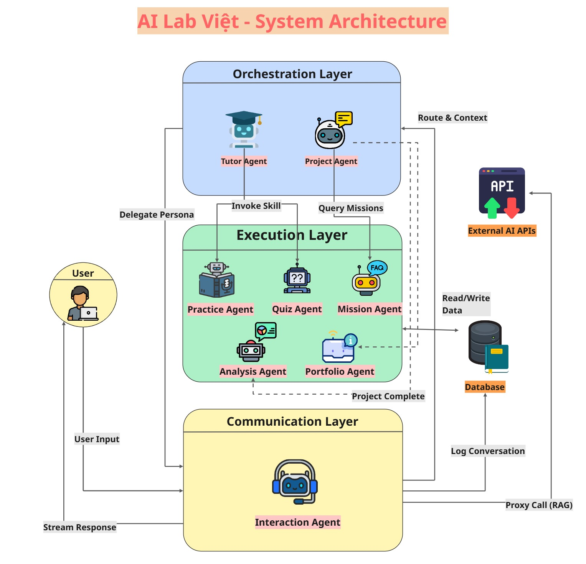
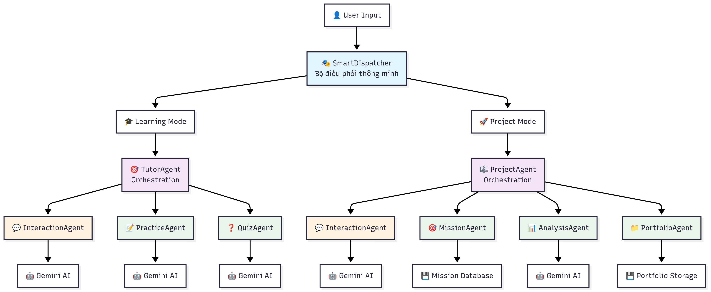
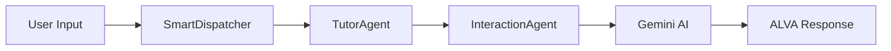
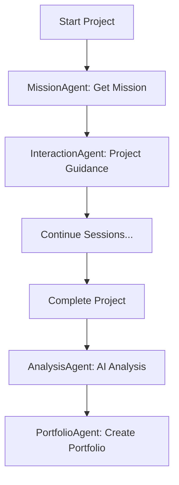

# 🤖 AI Lab Việt - Multi-Agent System

> **Hệ thống đa tác tử thông minh (Multi-Agent System) cho AI Lab Việt**  
> Xây dựng bằng Python, FastAPI và tích hợp Gemini AI

[](https://python.org)
[](https://fastapi.tiangolo.com)
[](https://ai.google.dev)
[](LICENSE)

## 📋 Mục lục

- [🎯 Tổng quan](#-tổng-quan)
- [🏗️ Kiến trúc hệ thống](#️-kiến-trúc-hệ-thống)
- [🚀 Cài đặt nhanh](#-cài-đặt-nhanh)
- [💡 Cách sử dụng](#-cách-sử-dụng)
- [🧩 Các Agent](#-các-agent)
- [🔄 Luồng hoạt động](#-luồng-hoạt-động)
- [🧪 Testing](#-testing)
- [📚 API Documentation](#-api-documentation)

## 🎯 Tổng quan

**AI Lab Việt Multi-Agent System** là một hệ thống đa tác tử thông minh được thiết kế để tạo ra trải nghiệm học tập AI toàn diện. Hệ thống sử dụng kiến trúc **phân tán** với các agent chuyên biệt, mỗi agent đảm nhận một nhiệm vụ cụ thể trong quy trình học tập và phát triển dự án.

## 🤖 Multi-Agent System



### ✨ Tính năng chính

- **🎓 Hệ thống Tutor AI**: Gia sư AI thông minh ALVA hỗ trợ học tập cá nhân hóa
- **🚀 Quản lý dự án**: Cộng sự AI Sáng tạo ALVA hỗ trợ hoàn thành các dự án thực tế đi từ Luồng HÀNH → CHỨNG MINH với phân tích và portfolio tự động
- **🎯 Tạo bài tập động**: AI tự động tạo bài tập thực hành phù hợp với từng chủ đề
- **📝 Quiz thông minh**: Tạo quiz đánh giá với nhiều dạng câu hỏi
- **📊 Phân tích học tập**: AI phân tích quá trình học và đưa ra insights
- **🔗 Tích hợp Gemini AI**: Sử dụng Google Gemini cho khả năng AI mạnh mẽ

## ⚡ System Architecture



### 🎪 Demo trực tiếp

```bash
# Chạy hệ thống
python main.py

# Test ALVA với hai nhân cách Tutor và Project
python demo_alva_personas.py

# Test tất cả agents
python demo_all_llm_agents.py

# Test luồng học tập
python demo_tutor_flow.py

# Test luồng dự án
python demo_project_flow.py
```

## 🏗️ Kiến trúc hệ thống

### 📐 Kiến trúc 3 tầng

```
🎭 SmartDispatcher (Bộ điều phối trung tâm)
├── 🎯 Orchestration Layer (Tầng điều phối)
│   ├── TutorAgent - Điều phối học tập
│   └── ProjectAgent - Điều phối dự án
├── ⚡ Execution Layer (Tầng thực thi)
│   ├── 📊 AnalysisAgent - Phân tích AI
│   ├── 🎯 PracticeAgent - Tạo bài tập AI
│   ├── 📝 QuizAgent - Tạo quiz AI
│   ├── 🎯 MissionAgent - Quản lý missions
│   └── 📁 PortfolioAgent - Quản lý portfolio
└── 💬 Communication Layer (Tầng giao tiếp)
    └── InteractionAgent - Gateway đến Gemini AI
```

### 🔗 Dependency Injection Pattern

```python
# Core Dependencies
InteractionAgent → Gemini AI Gateway

# AI-Powered Agents (Call LLM)
AnalysisAgent(InteractionAgent)
PracticeAgent(InteractionAgent)
QuizAgent(InteractionAgent)

# Orchestration Agents
TutorAgent(InteractionAgent)
ProjectAgent(InteractionAgent, MissionAgent, AnalysisAgent, PortfolioAgent)
```

## 🚀 Cài đặt nhanh

### 📋 Yêu cầu hệ thống

- **Python 3.10+**
- **Redis server**
- **Supabase**
- **Gemini API Key** (từ [Google AI Studio](https://makersuite.google.com/app/apikey))

### ⚡ Cài đặt trong 3 bước

```bash
# 1. Clone repository
git clone <repository-url>
cd ALV-Multiagent/ai_lab_viet

# 2. Cài đặt dependencies
pip install -r requirements.txt

# 3. Cấu hình API key
echo "GEMINI_API_KEY=your_api_key_here" > .env
```

### 🔧 Cấu hình chi tiết

1. **Tạo file `.env`**:

```env
GEMINI_API_KEY=your_actual_gemini_api_key_here
SUPABASE_URL=your_supabase_url
SUPABASE_KEY=your_supabase_key
REDIS_HOST=localhost
REDIS_PORT=6379
REDIS_DB=0
REDIS_DB_CELERY=1
```

2. **Kiểm tra cài đặt**:

```bash
python -c "from core.dispatcher import SmartDispatcher; print('✅ Setup successful!')"
```

## 💡 Cách sử dụng

### 🎯 Chạy server FastAPI

```bash
# Khởi động server
python main.py

# Server sẽ chạy tại: http://127.0.0.1:8000
# API docs tại: http://127.0.0.1:8000/docs
```

### 🧪 Test các tính năng

```bash
# Test tất cả 4 LLM agents
python demo_all_llm_agents.py

# Test riêng từng luồng
python demo_tutor_flow.py      # Luồng học tập
python demo_project_flow.py    # Luồng dự án
```

### 📡 Sử dụng API

```python
import requests

# Test tutor flow
response = requests.post("http://127.0.0.1:8000/test_tutor_flow",
                        json={"user_input": "Giải thích về machine learning"})

# Test project flow
response = requests.post("http://127.0.0.1:8000/test_project_flow")

# Tương tác chung
response = requests.post("http://127.0.0.1:8000/interact",
                        json={
                            "user_input": "Tôi muốn học AI",
                            "session_context": {
                                "mode": "learning",
                                "user_id": "user123"
                            }
                        })
```

## 🧩 Các Agent

### 🎯 Orchestration Agents (Điều phối)

#### 🎓 TutorAgent

- **Vai trò**: Gia sư AI ALVA
- **Chức năng**: Điều phối trải nghiệm học tập cá nhân hóa
- **AI Integration**: ✅ (qua InteractionAgent)

```python
# Sử dụng TutorAgent
context = {
    "mode": "learning",
    "current_lesson": "Machine Learning Basics",
    "user_level": "beginner"
}
result = dispatcher.dispatch("Giải thích về supervised learning", context)
```

#### 🚀 ProjectAgent

- **Vai trò**: Conductor cho luồng dự án
- **Chức năng**: Điều phối HÀNH → CHỨNG MINH workflow
- **Sub-flows**: `start_project`, `continue_session`, `complete_project`

```python
# Bắt đầu dự án
context = {"mode": "project", "sub_task": "start_project", "mission_id": "mission_01"}
result = dispatcher.dispatch("Bắt đầu dự án marketing", context)
```

### ⚡ Execution Agents (Thực thi)

#### 📊 AnalysisAgent

- **AI Integration**: ✅ Phân tích chat history với Gemini
- **Output**: Featured prompts, skills, learning insights

```python
# Phân tích chat history
params = {"chat_history": [...], "analysis_type": "learning_progress"}
result = analysis_agent.execute(params)
```

#### 🎯 PracticeAgent

- **AI Integration**: ✅ Tạo bài tập thực hành với Gemini
- **Output**: Structured exercises với test cases

```python
# Tạo bài tập
params = {
    "topic": "Python Programming",
    "difficulty_level": "intermediate",
    "exercise_type": "coding"
}
result = practice_agent.execute(params)
```

#### 📝 QuizAgent

- **AI Integration**: ✅ Tạo quiz đánh giá với Gemini
- **Output**: Multi-format questions với explanations

```python
# Tạo quiz
params = {
    "topic": "Machine Learning",
    "question_count": 10,
    "question_types": ["multiple_choice", "true_false"]
}
result = quiz_agent.execute(params)
```

#### 🎯 MissionAgent

- **AI Integration**: ❌ Logic-based
- **Chức năng**: Quản lý database missions và project templates

#### 📁 PortfolioAgent

- **AI Integration**: ❌ Logic-based
- **Chức năng**: Tạo và lưu trữ portfolio cards

## 🧠 RAG Engine - Dual-Source Strategy

### 📖 Tổng quan

Hệ thống RAG (Retrieval Augmented Generation) với chiến lược dual-source khác nhau cho từng persona ALVA:

### 🎯 Chiến lược RAG

#### 📚 Tutor ALVA (Module HỌC)

- **Primary Source**: Curriculum (Giáo trình)
- **Secondary Source**: Chat History (Ngữ cảnh)
- **Mục tiêu**: Trả lời chính xác dựa trên kiến thức giáo trình

```python
# RAG cho Tutor ALVA
rag_results = rag_engine.search_for_tutor(
    query="Delegation là gì?",
    chat_history=session_context["chat_history"]
)
# → Tìm trong curriculum trước, sau đó chat context
```

#### 🚀 Project ALVA (Module HÀNH)

- **Primary Source**: Chat History (Ngữ cảnh dự án)
- **Secondary Source**: Curriculum (Hỗ trợ kiến thức)
- **Mục tiêu**: Duy trì consistency + áp dụng kiến thức đã học

```python
# RAG cho Project ALVA
rag_results = rag_engine.search_for_project(
    query="Áp dụng Delegation trong team",
    chat_history=project_context["chat_history"]
)
# → Tìm trong chat history trước, curriculum hỗ trợ khi có keywords
```

### 🔄 Vòng lặp HỌC → HÀNH

1. **Tutor ALVA** dạy concepts từ giáo trình
2. **Project ALVA** áp dụng concepts vào dự án thực tế
3. Tạo ra trải nghiệm học tập hoàn chỉnh và liền mạch

### 🗃️ Knowledge Sources

- **Curriculum Database**: Delegation, R.C.T.C Framework, Machine Learning, etc.
- **Chat History**: Project context, decisions, brainstorming sessions
- **Smart Keyword Detection**: Tự động kích hoạt curriculum support

### 💬 Communication Agent

#### 🤖 InteractionAgent

- **Vai trò**: Gateway đến Gemini AI
- **Chức năng**: Xử lý tất cả communication với LLM
- **Features**: Persona system, context management, fallback handling

## 🔄 Luồng hoạt động

### 🎓 Learning Flow (Luồng học tập)



1. User gửi câu hỏi học tập
2. SmartDispatcher route đến TutorAgent
3. TutorAgent tạo persona "ALVA Tutor"
4. InteractionAgent gọi Gemini với persona + context
5. Trả về response được cá nhân hóa

### 🚀 Project Flow (Luồng dự án)



1. **Start**: Lấy mission details, AI guidance
2. **Work**: Continuous AI support trong quá trình làm
3. **Complete**: AI phân tích + tạo portfolio card

## 🧪 Testing

### 🔍 Test Coverage

| Component        | Test Type          | Status |
| ---------------- | ------------------ | ------ |
| InteractionAgent | Unit + Integration | ✅     |
| AnalysisAgent    | Unit + Integration | ✅     |
| PracticeAgent    | Unit + Integration | ✅     |
| QuizAgent        | Unit + Integration | ✅     |
| TutorAgent       | Integration        | ✅     |
| ProjectAgent     | Integration        | ✅     |
| Full System      | End-to-End         | ✅     |

### 🎯 Chạy tests

```bash
# Test tất cả agents
python demo_all_llm_agents.py

# Test specific flows
python demo_tutor_flow.py
python demo_project_flow.py

# Test với custom input
python -c "
from core.dispatcher import SmartDispatcher
dispatcher = SmartDispatcher()
result = dispatcher.dispatch('Test input', {'mode': 'learning'})
print(result)
"
```

### 📊 Expected Results

- **Success Rate**: 100% (5/5 tests passed)
- **LLM Calls**: 4 agents successfully calling Gemini
- **Fallback**: Graceful degradation khi không có API key
- **JSON Parsing**: Robust handling cho AI responses

## 📚 API Documentation

### 🔗 Endpoints

| Endpoint              | Method | Description          |
| --------------------- | ------ | -------------------- |
| `/`                   | GET    | Health check         |
| `/interact`           | POST   | General interaction  |
| `/test_tutor_flow`    | POST   | Test learning flow   |
| `/test_project_flow`  | POST   | Test project flow    |
| `/test_ai_connection` | GET    | Test AI connectivity |
| `/docs`               | GET    | Interactive API docs |

### 📝 Request/Response Examples

#### Interact Endpoint

```json
// POST /interact
{
  "user_input": "Tôi muốn học về neural networks",
  "session_context": {
    "mode": "learning",
    "user_id": "user123",
    "current_lesson": "Deep Learning Basics"
  }
}

// Response
{
  "agent_name": "TutorAgent",
  "response_message": "Chào bạn! Neural networks là...",
  "status": "success"
}
```

## 🛠️ Development

### 📁 Cấu trúc thư mục

```
ai_lab_viet/
├── agents/                 # Tất cả agents
│   ├── base.py            # Abstract base classes
│   ├── communication/     # InteractionAgent
│   ├── orchestration/     # TutorAgent, ProjectAgent
│   └── execution/         # Analysis, Practice, Quiz, Mission, Portfolio
├── core/                  # Core system
│   └── dispatcher.py      # SmartDispatcher
├── models/                # Pydantic schemas
│   └── schemas.py
├── demo_*.py             # Demo scripts
├── main.py               # FastAPI application
└── requirements.txt      # Dependencies
```

### 🔧 Thêm Agent mới

1. **Tạo agent class**:

```python
# agents/execution/new_agent.py
from agents.base import ExecutionAgent

class NewAgent(ExecutionAgent):
    def __init__(self, interaction_agent=None):
        self.interaction_agent = interaction_agent

    def execute(self, params):
        # Implementation
        pass
```

2. **Đăng ký trong dispatcher**:

```python
# core/dispatcher.py
self.new_agent = NewAgent(self.interaction_agent)
self.execution_agents["new"] = self.new_agent
```

3. **Test agent**:

```python
# test_new_agent.py
result = dispatcher.new_agent.execute({"test": "params"})
```

### 🎨 Customization

#### Thay đổi AI Provider

```python
# agents/communication/interaction_agent.py
# Thay thế Gemini bằng OpenAI, Claude, etc.
class InteractionAgent(CommunicationAgent):
    def __init__(self):
        # self.model = genai.GenerativeModel('gemini-1.5-flash')
        self.model = openai.ChatCompletion  # Example
```

#### Custom Personas

```python
# Tạo persona mới trong TutorAgent
persona_prompt = f"""
Bạn là {custom_character}, chuyên gia về {domain}.
Phong cách: {style}
Mục tiêu: {objectives}
"""
```

<div align="center">

**🚀 Built with ❤️ by AI Lab Việt**

</div>
